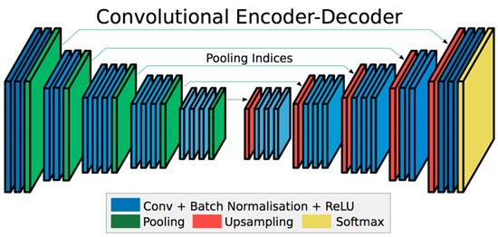

# Semantic Segmentation with SegNet using RGB-D Images

This project implements semantic segmentation using the SegNet model with RGB-D images. The dataset used is **NYU Depth V2**, and the code extracts, preprocesses, and trains a segmentation model.

## Table of Contents

- [Installation](#installation)
- [Dataset](#dataset)
- [SegNet Model Explanation](#segnet-model-explanation)
- [Training Setup](#training-setup)
- [Explanation of test_code.py](#explanation-of-test_codepy)

## System Requirements & Training Setup

Initially, I attempted to run the code on **Google Colab (free version)**, but it only worked for preprocessing the dataset. Training on Colab resulted in an error due to insufficient memory. To train the model, I used an **NVIDIA A100 server** available at my university, which has **80GB** of GPU memory. The code requires approximately **25GB** of memory during training.

## Installation

This project requires Python and the following libraries:

- **torch** (for deep learning operations)
- **h5py** (for handling MATLAB dataset files)
- **numpy** (for numerical computations)
- **scikit-learn** (for data splitting)

First, ensure you have Python installed. Then, install the required packages using:

```sh
pip install -r requirements.txt
```

> **Note:** PyTorch installation may vary depending on your system. Follow the [official PyTorch installation guide](https://pytorch.org/get-started/installation/) for detailed instructions.

## Dataset

This project uses the **NYU Depth V2** dataset. Download the **Labelled dataset (2.8GB)** from the following link:

🔗 [NYU Depth V2 Dataset](https://cs.nyu.edu/~fergus/datasets/nyu_depth_v2.html)

### Preparing the Dataset

1. Download the **Labelled dataset (2.8GB)**.
2. Ensure the dataset is placed in the **same location** where the code runs.
3. Run the following script to preprocess the dataset:

   ```sh
   python NYUD_Data_Preprocess_into_splits.py
   ```

### Preprocessing Steps
The preprocessing script will generate **8 new files**:
- `nyu_images.npy`
- `nyu_depths.npy`
- `image_with_depth.npy`
- `nyu_labels.npy`
- `val_image_with_depth.npy`
- `val_labels.npy`
- `test_image_with_depth.npy`
- `test_labels.npy`

The script performs the following steps:
1. **Normalizes** the RGB images and depth images.
2. **Concatenates** RGB images with depth images (grayscale).
3. **Splits** the dataset into training, validation, and test sets.


## Project Structure

```sh
├── training_code.py  # Main script for training the model, script use non pretrained model.
├── NYUD_Data_Preprocess_into_splits.py  # Dataset preprocessing script
├── segnet_pretrained_encoder  # pretrained model, use to increase training speed and accuracy
├── test_code.py  # Script for testing the model after training, ensure the correct segnet model you want is called(pretrained/non-pretrained. Creates results of with images of segmentation map and displays metrics.
├── inference_code_sample.py # currently not tested, make adjustments and only use this as reference.
├── images/              # Directory to images for README.md
├── README.md             # Project documentation
├── requirements.txt      # (Optional) List of dependencies
```

# SegNet Model Explanation

## Overview
SegNet is an encoder-decoder model designed for semantic segmentation. It utilizes max pooling indices during upsampling to enhance feature retention and reduce computational complexity. The encoder part of SegNet is identical to the convolutional layers of the VGG16 model, allowing the use of pretrained VGG16 weights for initializing the encoder layers. 

Using pretrained weights is beneficial as it leverages a model trained on large datasets like ImageNet, which has already learned important feature representations such as edges, textures, and objects. This significantly reduces training time and improves performance, especially when data is limited.




## Model Components
The SegNet model in `segnet_pretrained_encoder.py` consists of four main classes:

### 1. ConvBNReLU (Blue Layer)
This is the fundamental building block of the SegNet model, representing each **blue layer** (as seen in the corresponding image). At each blue layer, three operations are performed sequentially:
   - **Convolution:** Extracts spatial features.
   - **Batch Normalization:** Normalizes activations to stabilize learning.
   - **ReLU Activation:** Introduces non-linearity to capture complex patterns.
   
Since this pattern is repeated throughout the network, the `ConvBNReLU` class encapsulates these operations as a reusable unit.

### 2. EncoderBlock
An **encoder block** consists of multiple blue layers (either 2 or 3) followed by a **green layer** (max pooling). Thus, a single encoder block can be represented as:
   - **2 or 3 Blue Layers** (ConvBNReLU layers)
   - **1 Green Layer** (Max Pooling layer)

**Max Pooling** reduces spatial dimensions while preserving critical feature information, helping with downsampling and computational efficiency.

#### Feature Maps and Training Considerations
- The input to an encoder block is a **feature map** from the previous layer, which contains spatial patterns extracted from images.
- Feature maps have dimensions `(batch_size, channels, height, width)`, where batch size (`n`) affects training efficiency:
  - **Larger batches** offer stable gradients but may generalize poorly.
  - **Smaller batches** improve generalization but introduce noisy updates.
- The encoder block returns both the **feature map** and the **pooling indices** from max pooling for later upsampling.

### 3. DecoderBlock
A **Decoder block** consists of an upsampling layer(red layer) followed by multiple multiple blue layers (either 2 or 3). The decoder block mirrors the encoder but includes an important distinction:
- In the **final decoder block**, the last convolutional layer should output the final feature map without batch normalization and ReLU. 
- This is because the output represents raw class scores (logits), which will be used in the loss function (e.g., `CrossEntropyLoss`). Applying ReLU or normalization at this stage would distort the classification scores.

### 4. SegNet Model Structure
The SegNet model consists of 10 encoder and decoder blocks. 
- The **encoder layers** use the pretrained weights of VGG16, which include only the convolutional and batch normalization sublayers (not ReLU).
- For instance, `self.enc1 = EncoderBlock(vgg16[:5])` corresponds to the first block, utilizing layers `0-4` from VGG16.
- Another example, `self.enc3 = EncoderBlock(vgg16[10:17])`, assigns 7 layers to 3 blue layers:
  - Each blue layer contains a trainable **convolution** and **batch normalization** sublayer.
  - For 3 blue layers: `(2 + 2) * 3 = 6` trainable layers.
  - Adding the max pooling layer results in a total of 7 trainable layers.

## Understanding `in_channels = out_channels`
In the training script, the SegNet model does not use pretrained weights. A key implementation detail is the `in_channels = out_channels` pattern:
```python
in_channels = out_channels
```
- In the **encoder block**, `in_channels = out_channels` after the first layer to ensure consistent depth.
- In the **decoder block**, `in_channels = out_channels` is applied at the last layer to maintain feature consistency.

### Channel Progression in an Encoder Block
Consider an encoder block with 3 convolutional layers:
1. **Layer 1:** `in_channels → intermediate_channels_1`
2. **Layer 2:** `intermediate_channels_1 → intermediate_channels_2`
3. **Layer 3:** `intermediate_channels_2 → out_channels`

This ensures that the first convolution's `in_channels` matches the block’s input, while the last convolution's `out_channels` matches the block’s output. Intermediate layers can have different channels depending on feature extraction needs.

## Decoder Block Design
If the encoder follows an **expanding channel** structure, the decoder should mirror it symmetrically with decreasing channels:
- **Mirroring Encoder A:**
  - Layer 1: `in=y → out=y`
  - Layer 2: `in=y → out=y`
  - Layer 3: `in=y → out=x`

This ensures that high-level features are retained before reconstructing the segmentation mask.

## Conclusion
The SegNet model effectively repurposes the VGG16 encoder while utilizing max pooling indices for upsampling. The design choices, including the use of pretrained weights and structured encoder-decoder channel transitions, significantly enhance segmentation performance while maintaining computational efficiency.

---

# Training Setup

Before starting the training process, we need to define essential components such as the dataset, data loader, hyperparameters, loss function, and optimizer. These ensure that the model is trained efficiently and effectively.

### Dataset Class and Data Shuffling

We define a custom dataset class `NYUDataset`, which loads RGB-D images along with their corresponding labels:

```python
class NYUDataset(Dataset):
    def __init__(self, image_with_depth_path, label_path, transform=None):
        self.images_with_depth = torch.load(image_with_depth_path)
        self.labels = torch.load(label_path)
        self.transform = transform

    def __len__(self):
        return len(self.images_with_depth)

    def __getitem__(self, idx):
        image_with_depth = self.images_with_depth[idx]
        label = self.labels[idx]

        if self.transform:
            image_with_depth, label = self.transform(image_with_depth, label)

        return image_with_depth, label

    def shuffle_data(self):
        indices = torch.randperm(len(self.images_with_depth))
        self.images_with_depth = self.images_with_depth[indices]
        self.labels = self.labels[indices]
```

#### Importance of Shuffling
Shuffling the dataset is crucial because it prevents the model from learning any unintended patterns in the order of the data. It helps in generalization and prevents bias caused by sequential data order.

### Hyperparameters

We define key hyperparameters for training:

```python
learning_rate = 0.001
epochs = 50
batch_size = 32
```

- **Learning Rate (`0.001`)**: Determines the step size for updating weights. A small learning rate ensures stable convergence, while a large value can lead to instability.
- **Epochs (`50`)**: The number of full passes through the dataset. Too few epochs might lead to underfitting, while too many can cause overfitting.
- **Batch Size (`32`)**: The number of samples processed before updating the model weights. A batch size of 32 balances memory usage and model performance.

### DataLoader

The `DataLoader` prepares batches for training and validation:

```python
dataset = NYUDataset(image_with_depth_path, label_path)
val_dataset = NYUDataset(val_image_with_depth_path, val_label_path)

train_loader = DataLoader(dataset, batch_size=16, shuffle=True)
val_loader = DataLoader(val_dataset, batch_size=batch_size, shuffle=False)
```

- **Shuffle=True for Training**: Ensures that each epoch gets a different order of training data.
- **Shuffle=False for Validation**: Preserves consistency in validation evaluation.

### Loss Function and Optimizer

```python
loss_fn = nn.CrossEntropyLoss()
optimizer = torch.optim.Adam(model.parameters(), lr=learning_rate)
```

- **CrossEntropyLoss**: Suitable for multi-class classification problems like semantic segmentation.
- **Adam Optimizer**: Chosen for its adaptive learning rate, which helps in faster and more stable convergence.

---

## Training Process

The `train` function handles the training and validation loops, model optimization, and checkpointing.

### Learning Rate Scheduler

We use a learning rate scheduler to adjust the learning rate when the validation loss stops improving:

```python
scheduler = ReduceLROnPlateau(optimizer, mode='min', factor=0.1, patience=3, verbose=True)
```

- **`ReduceLROnPlateau`**: Reduces the learning rate when validation loss plateaus, preventing overfitting.
- **`factor=0.1`**: Reduces the learning rate by a factor of 10.
- **`patience=3`**: If the validation loss doesn’t improve for 3 consecutive epochs, the learning rate is reduced.

### Early Stopping and Checkpointing

- **Early Stopping**: Stops training if no improvement is observed in `early_stopping_patience=5` epochs.
- **Checkpointing**: Saves the best model based on validation loss.

```python
if avg_val_loss < best_val_loss:
    best_val_loss = avg_val_loss
    no_improvement_count = 0
    torch.save(model.state_dict(), checkpoint_dir / 'best_model.pth')
else:
    no_improvement_count += 1
    if no_improvement_count >= early_stopping_patience:
        print(f"No improvement in validation loss for {early_stopping_patience} epochs. Stopping training.")
        break
```

### Full Training Loop

```python
def train(model, train_loader, val_loader, optimizer, loss_fn, device, epochs, early_stopping_patience=5):
    model.to(device)
    best_val_loss = float('inf')
    scheduler = ReduceLROnPlateau(optimizer, mode='min', factor=0.1, patience=3, verbose=True)
    checkpoint_dir = Path('checkpoints')
    checkpoint_dir.mkdir(parents=True, exist_ok=True)

    for epoch in range(epochs):
        print(f"Epoch: {epoch+1}/{epochs}")
        train_loader.dataset.shuffle_data()
        model.train()
        total_loss = 0.0

        for images_with_depth, labels in train_loader:
            images_with_depth, labels = images_with_depth.to(device), labels.to(device)
            optimizer.zero_grad()
            outputs = model(images_with_depth)
            loss = loss_fn(outputs, labels)
            loss.backward()
            optimizer.step()
            total_loss += loss.item()

        avg_loss = total_loss / len(train_loader)
        print(f"Average Training Loss: {avg_loss:.4f}")

        # Validation loop
        model.eval()
        val_loss = 0.0
        with torch.no_grad():
            for val_images_with_depth, val_labels in val_loader:
                val_images_with_depth, val_labels = val_images_with_depth.to(device), val_labels.to(device)
                val_outputs = model(val_images_with_depth)
                val_loss += loss_fn(val_outputs, val_labels).item()

        avg_val_loss = val_loss / len(val_loader)
        print(f"Average Validation Loss: {avg_val_loss:.4f}")

        scheduler.step(avg_val_loss)
        
        # Save best model checkpoint
        if avg_val_loss < best_val_loss:
            best_val_loss = avg_val_loss
            torch.save(model.state_dict(), checkpoint_dir / 'best_model.pth')
```

This setup ensures stable training by:
- Shuffling data for generalization
- Using proper batch size and learning rate
- Adopting early stopping and learning rate scheduling
- Saving model checkpoints for reproducibility

The next step is evaluating the trained model and analyzing its performance.

---

# Explanation of test_code.py

test_code.py is used for evaluating the performance of the trained SegNet model on the test dataset. It performs the following key tasks:

1. **Loading the Test Dataset**
   - The `NYUDataset` class loads the test images with depth information and their corresponding ground truth labels.
   - The test dataset is stored in `.pt` format and is loaded using `torch.load()`.
   - A `DataLoader` is created to efficiently iterate over the test dataset in batches.

2. **Model Evaluation Setup**
   - The trained SegNet model is loaded from the checkpoint `best_model.pth`.
   - The model is moved to the appropriate device (`CPU` or `CUDA` if available) and set to evaluation mode using `model.eval()`.

3. **Scoring Techniques and Metrics**
   The code implements multiple evaluation metrics to assess the model's segmentation performance:
   
   - **Intersection over Union (IoU)**:
     - IoU is calculated as the ratio of the intersection of predicted and ground truth labels to their union.
     - Higher IoU values indicate better segmentation performance.
     
   - **Dice Coefficient**:
     - The Dice Coefficient measures the similarity between predicted and ground truth labels.
     - It is calculated as twice the intersection divided by the sum of predicted and ground truth pixels.
     - Similar to IoU, higher Dice scores indicate better model performance.
     
   - **Pixel Accuracy**:
     - The percentage of correctly classified pixels in the entire image.
     - A high pixel accuracy value suggests that most pixels were assigned the correct class.
     
   - **Class-wise Accuracy (Commented Out)**:
     - The script contains a commented-out function `calculate_class_accuracy()`, which calculates the accuracy for each class individually.
     - This can be useful when analyzing model performance for different object classes.

4. **Iterating Over the Test Dataset**
   - The script iterates through the test dataset batch by batch.
   - For each batch:
     - The input image is passed through the model to obtain predictions.
     - Softmax is applied to get probabilities for each class.
     - The class with the highest probability is selected as the predicted segmentation mask.
     - The computed segmentation mask is compared with the ground truth label using the above metrics.
     - The computed metrics (IoU, Dice Coefficient, Pixel Accuracy) are stored for later aggregation.
     
5. **Visualizing Predictions**
   - The `visualize_predictions()` function is used to display the following:
     - The **input image** (RGB-D image)
     - The **ground truth segmentation mask**
     - The **predicted segmentation mask**
   - These are displayed side by side using Matplotlib for easy comparison.
   - The user is prompted to press Enter to continue viewing the next prediction.

6. **Computing and Displaying Final Metrics**
   - After processing all test images, the script calculates the average values for:
     - IoU
     - Dice Coefficient
     - Pixel Accuracy
   - The results are printed to summarize the model’s performance.
   - Class-wise accuracies (if implemented) can also be displayed.

## Results:


### Summary
The `test_code.py` script efficiently evaluates the SegNet model using multiple performance metrics and provides a visualization of predictions for qualitative assessment. It ensures a thorough evaluation of the segmentation results on the test dataset, making it easier to analyze strengths and weaknesses in the model’s predictions.


## References

- [SegNet Paper](https://arxiv.org/pdf/1511.00561)
- [SegNet-RGB-D-for-Semantic-Segmentation](https://github.com/Yangzhangcst/RGBD-semantic-segmentation)
- [PyTorch implementation of SegNet: A Deep Convolutional Encoder-Decoder trained on NYUDv2 Dataset](https://cs.nyu.edu/~fergus/datasets/nyu_depth_v2.html)
- [NYU Depth V2 Dataset (Download Labelled dataset, 2.8GB)](https://cs.nyu.edu/~fergus/datasets/nyu_depth_v2.html)
- [Comparison of deep learning models for RGB-D Semantic Segmentation](https://github.com/Yangzhangcst/RGBD-semantic-segmentation)
- [Building SegNet from Scratch using PyTorch (helped in model development)](https://medium.com/@nikdenof/segnet-from-scratch-using-pytorch-3fe9b4527239)
- [SUNRGBD Metadata Repo - Train-Test Labels (Larger dataset than NYUDv2 but lower image quality)](https://github.com/ankurhanda/sunrgbd-meta-data)
- [Optimized SUN RGBD Repository](https://github.com/chrischoy/SUN_RGBD)

---
